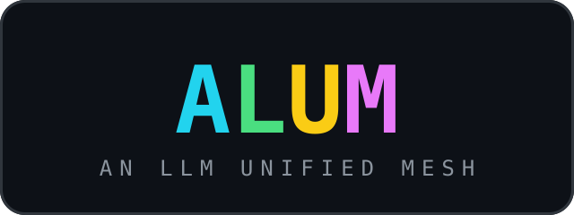

# ALUM — An LLM Unified Mesh

  

ALUM aggregates **Argo**, **ALCF**, **AskSage**, and local **Ollama**
(including Ollama cloud models) behind one OpenAI-compatible endpoint.

The translation mesh is [`llm-rosetta-gateway`](https://github.com/Oaklight/llm-rosetta),
served by default on port **46701**.

ALUM itself is a **configuration & orchestration layer**:

- detects which upstream services are alive,
- walks you through service + model selection in the terminal,
- generates `config.jsonc` for `llm-rosetta-gateway`,
- launches and monitors the whole mesh.

No gateway logic is re-implemented here. If you only need protocol
translation, use `llm-rosetta(-gateway)` directly; if you need one-command
multi-service aggregation with docs, use ALUM.
